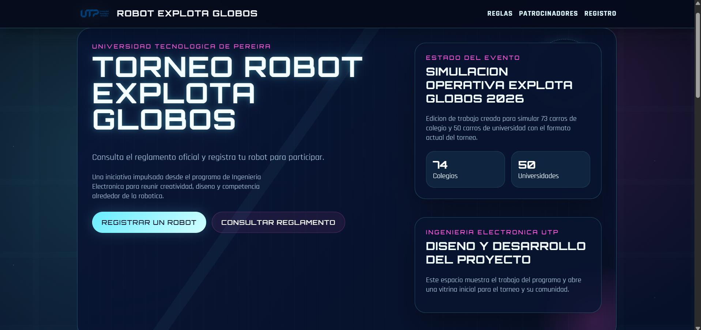
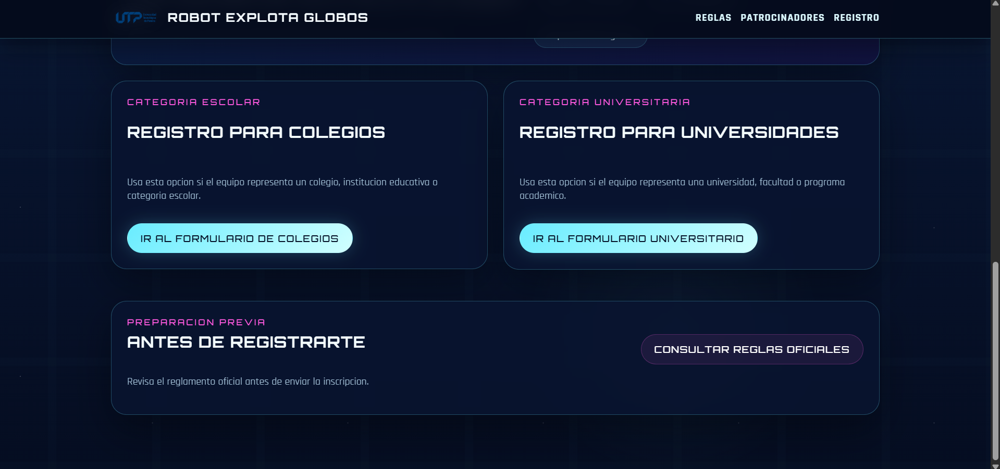
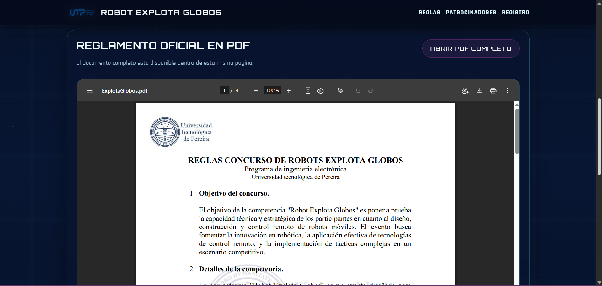
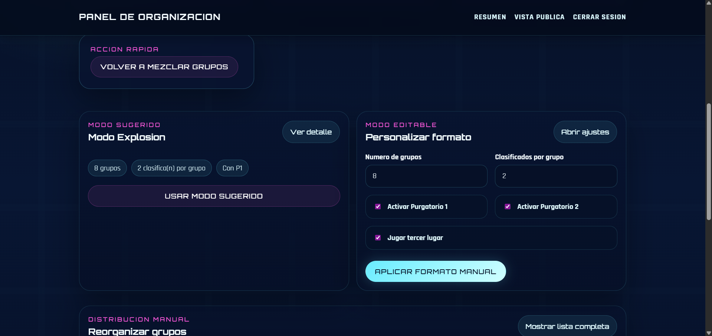
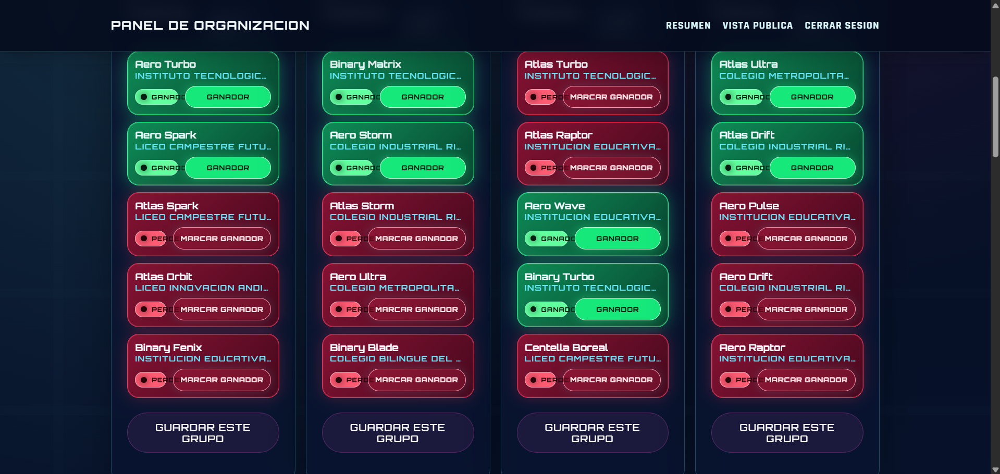
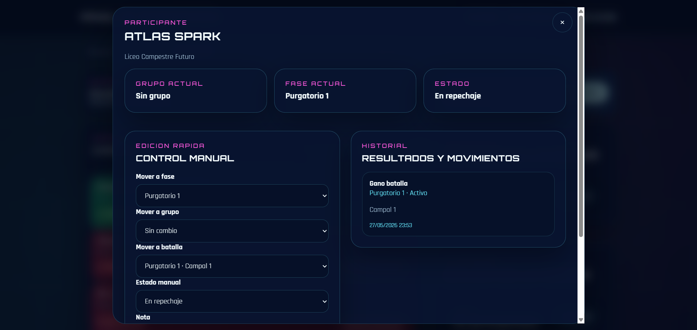
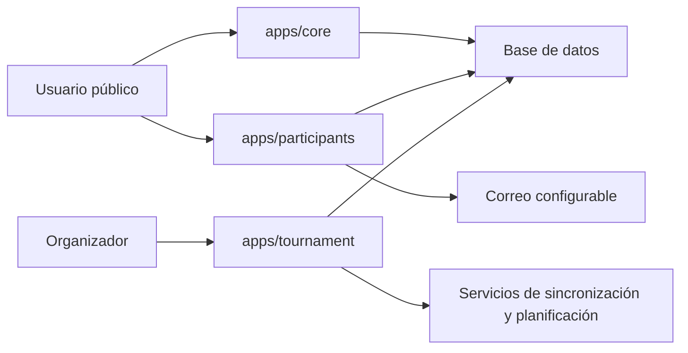
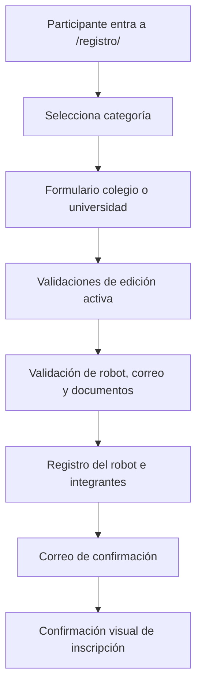
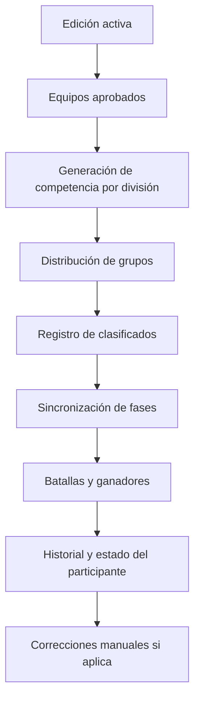

# Torneo Robot Explota Globos UTP

Plataforma web desarrollada con Django para apoyar la gestión operativa del torneo Robot Explota Globos UTP. El sistema centraliza la publicación de reglas, el registro de robots participantes y el control de formatos de competencia con grupos, fases, repechajes, resultados y movimientos manuales.

Este repositorio funciona como presentación técnica de portafolio para GitHub y LinkedIn. El proyecto nace del contexto real del torneo Robot Explota Globos UTP y evoluciona como una herramienta configurable para validar escenarios de competencia, automatizar tareas organizativas y facilitar el seguimiento del torneo.

## Vista rápida

| Área | Descripción |
| --- | --- |
| Dominio | Gestión de torneo de robótica competitiva |
| Backend | Django 5.2 LTS |
| Base de datos | PostgreSQL en producción, SQLite para desarrollo local |
| Frontend | Templates Django, HTML, CSS y JavaScript |
| Configuración | Variables de entorno con `.env.example` |
| Estado | Prototipo funcional con pruebas piloto y simulaciones operativas |

## Capturas

Las capturas corresponden a pruebas piloto y simulaciones utilizadas para validar la lógica del torneo. Los datos visibles son de demostración y sirven para probar flujos de registro, distribución de grupos, clasificación, repechajes y control manual de participantes.

### Página pública del torneo



### Registro por categoría



### Reglamento oficial integrado



### Configuración del formato de competencia



### Validación de grupos y resultados



### Control manual de participantes



## Contexto del proyecto

Robot Explota Globos es una competencia de robótica en la que equipos de colegios y universidades participan con robots diseñados para cumplir las reglas oficiales del evento. Esta plataforma fue desarrollada para apoyar la gestión del torneo Robot Explota Globos UTP, especialmente en:

- Registro de robots por categoría.
- Consulta pública del reglamento.
- Organización inicial de participantes.
- Simulación de formatos de competencia.
- Control operativo de fases, grupos y resultados.

El archivo `static/docs/ExplotaGlobos.pdf` se conserva en el repositorio porque contiene las reglas oficiales del torneo.

## Funcionalidades actuales

- Página pública del evento con información del torneo, accesos a reglas y registro.
- Registro diferenciado para categoría escolar y categoría universitaria.
- Validación de inscripciones contra una edición activa del torneo.
- Prevención de duplicados por nombre de robot, correo y documento del líder.
- Registro de integrantes por equipo con líder obligatorio e integrantes opcionales.
- Envío configurable de correos de confirmación.
- Confirmación de asistencia mediante token único.
- Modelado de instituciones, equipos, miembros, ediciones, reglas, fases y enfrentamientos.
- Panel interno protegido para organizadores.
- Generación de planes por división: colegios y universidades.
- Formatos automáticos según cantidad de equipos inscritos.
- Configuración manual de grupos, clasificados, repechajes y tercer lugar.
- Registro de ganadores por grupo o batalla.
- Sincronización de estados de participantes durante el avance del torneo.
- Historial de movimientos, resultados y correcciones manuales.

## Escalabilidad y configuración

La lógica del torneo está diseñada para adaptarse a diferentes tamaños y formatos de competencia. El sistema puede sugerir automáticamente un formato según la cantidad de equipos o permitir ajustes manuales desde el panel de organización.

Actualmente soporta escenarios como:

- Fase de grupos balanceada.
- Clasificación por cantidad configurable de equipos por grupo.
- Cuadros finales sin byes.
- Ronda de 32, octavos, cuartos, semifinal, tercer lugar y final.
- Purgatorio 1 y Purgatorio 2 como mecanismos de repechaje.
- Batallas tipo duelo, triangular y campal.
- Correcciones manuales cuando la operación real del torneo requiere ajustes.

Esta base permite extender el sistema hacia nuevos formatos, reglas de clasificación, visualización pública de resultados y operación en tiempo real.

## Arquitectura

El proyecto sigue una organización modular por dominio:



### Módulos principales

- `config/`: configuración central de Django, rutas principales, WSGI y ASGI.
- `apps/core/`: páginas públicas, inicio, reglas y patrocinadores.
- `apps/participants/`: formularios, modelos, vistas y servicios de inscripción.
- `apps/tournament/`: modelos, formatos, planificación, servicios y vistas del panel operativo.
- `apps/common/`: componentes reutilizables del dominio.
- `static/css/`: estilos públicos del sitio.
- `static/js/`: scripts del sistema.
- `static/docs/`: documentos públicos del torneo, incluyendo el reglamento oficial.
- `static/sponsors/`: recursos visuales de patrocinadores y contexto del evento.
- `logos_patrocinadores/`: logos usados como referencia visual del torneo.
- `docs/screenshots/`: capturas utilizadas para documentar pruebas piloto y simulaciones.

### Flujo de inscripción



### Flujo operativo del torneo



## Modelo de dominio

- `TournamentEdition`: edición del torneo; solo una puede estar activa.
- `RuleSection`: secciones de reglas publicables.
- `SchoolRegistration` y `UniversityRegistration`: inscripciones públicas por categoría.
- `SchoolParticipant` y `UniversityParticipant`: integrantes asociados a una inscripción.
- `Institution`, `Team` y `TeamMember`: estructura operativa para equipos oficiales.
- `DivisionCompetition`: competencia por división, por ejemplo colegios o universidades.
- `DivisionGroup` y `DivisionGroupEntry`: distribución de equipos en grupos.
- `CompetitionBattle` y `CompetitionBattleEntry`: batallas configurables por fase.
- `TeamCompetitionState`: estado actual de cada equipo dentro de la competencia.
- `CompetitionHistoryEntry`: historial de resultados, movimientos y correcciones.
- `TournamentPhase` y `Match`: base flexible para fases y enfrentamientos generales.

## Stack tecnológico

- Python
- Django 5.2 LTS
- PostgreSQL
- SQLite para desarrollo local
- HTML, CSS y JavaScript
- python-dotenv
- psycopg

## Instalación local

1. Clona el repositorio.
2. Crea y activa un entorno virtual de Python.
3. Instala las dependencias:

```bash
pip install -r requirements.txt
```

4. Copia el archivo de ejemplo de variables de entorno:

```bash
cp .env.example .env
```

En Windows PowerShell:

```powershell
Copy-Item .env.example .env
```

5. Ajusta los valores de `.env` según tu entorno local.

Para desarrollo rápido puedes usar SQLite con:

```env
DJANGO_DEBUG=True
DJANGO_DATABASE=sqlite
```

Para un entorno más cercano a producción, configura PostgreSQL con:

```env
POSTGRES_DB=robot_tournament
POSTGRES_USER=robot_app
POSTGRES_PASSWORD=replace-with-a-strong-database-password
POSTGRES_HOST=127.0.0.1
POSTGRES_PORT=5432
```

## Variables de entorno

El archivo `.env.example` documenta las variables necesarias para levantar el proyecto localmente:

- `DJANGO_SECRET_KEY`: clave secreta local o de producción.
- `DJANGO_DEBUG`: activa o desactiva el modo debug.
- `DJANGO_ALLOWED_HOSTS`: hosts permitidos por Django.
- `DJANGO_CSRF_TRUSTED_ORIGINS`: orígenes confiables para protección CSRF.
- `DJANGO_DATABASE`: motor esperado para desarrollo local, por ejemplo `sqlite`.
- `POSTGRES_DB`, `POSTGRES_USER`, `POSTGRES_PASSWORD`, `POSTGRES_HOST`, `POSTGRES_PORT`: configuración de PostgreSQL.
- `DJANGO_EMAIL_BACKEND`, `EMAIL_HOST`, `EMAIL_PORT`, `EMAIL_HOST_USER`, `EMAIL_HOST_PASSWORD`, `EMAIL_USE_TLS`, `EMAIL_USE_SSL`, `DEFAULT_FROM_EMAIL`: configuración de correo.

No subas archivos `.env` reales al repositorio. El archivo `.env.example` debe contener solo placeholders seguros.

## Comandos principales

Crear migraciones:

```bash
python manage.py makemigrations
```

Aplicar migraciones:

```bash
python manage.py migrate
```

Crear usuario administrador:

```bash
python manage.py createsuperuser
```

Ejecutar servidor local:

```bash
python manage.py runserver
```

Verificar configuración de despliegue:

```bash
python manage.py check --deploy
```

## Seguridad y privacidad

Este proyecto está preparado para mantener fuera del repositorio archivos sensibles o locales:

- `.env` está ignorado y no debe publicarse.
- `db.sqlite3` y archivos `*.sqlite3` están ignorados.
- Entornos virtuales, cachés, logs y archivos temporales están ignorados.
- Las credenciales reales de correo, base de datos y claves secretas deben configurarse mediante variables de entorno.
- `DEBUG` está desactivado por defecto en la configuración.
- La clave secreta de Django es obligatoria cuando el proyecto no está en modo desarrollo.
- SQLite queda reservado para desarrollo local.

No uses datos reales de estudiantes, colegios, universidades, documentos, correos o participantes en una base de datos que vaya a publicarse. Para demos o portafolio, usa datos ficticios o semillas controladas.

## Logos y recursos visuales

Los logos incluidos corresponden al contexto visual del torneo, semillero, institución o patrocinadores. Deben usarse respetando los permisos institucionales o de las organizaciones correspondientes.

Si el repositorio se reutiliza fuera del contexto del torneo Robot Explota Globos UTP, revisa primero si esos recursos pueden mantenerse, reemplazarse o retirarse.

## Estado actual

El proyecto cuenta con una base funcional para registro público y administración inicial del torneo. Incluye modelos de inscripción, participantes, ediciones, reglas, fases, grupos, batallas, estados por equipo e historial de movimientos.

Las capturas documentan una simulación operativa utilizada para validar el comportamiento del sistema con datos piloto: distribución de equipos, configuración de formatos, registro de ganadores, estados de repechaje y control manual.

Estado recomendado para portafolio:

- Código funcional como demostración técnica.
- README orientado a instalación, revisión y presentación profesional.
- Variables sensibles documentadas mediante `.env.example`.
- Archivos locales y secretos excluidos mediante `.gitignore`.
- Reglamento oficial disponible en `static/docs/ExplotaGlobos.pdf`.
- Capturas disponibles en `docs/screenshots/`.

## Roadmap

1. Añadir una semilla de datos demo segura y reproducible para portafolio.
2. Incorporar pruebas automáticas para modelos, formularios, servicios de torneo y vistas críticas.
3. Mejorar la visualización pública de resultados, llaves y estados por categoría.
4. Añadir exportación de resultados para organizadores.
5. Documentar una guía de despliegue con PostgreSQL, archivos estáticos y servidor WSGI/ASGI.
6. Evaluar soporte para operación en tiempo real durante el evento.
7. Fortalecer auditoría de cambios, permisos por rol y bitácora administrativa.
8. Revisar permisos de uso de logos y recursos visuales antes de reutilizar el proyecto en otro contexto.
9. Preparar capturas finales sin datos reales ni elementos del sistema operativo.

## Nota para portafolio

Este repositorio muestra una solución Django aplicada a un caso real de gestión de torneo: registro de participantes, modelado de dominio, configuración por entorno, planificación de formatos competitivos y primeras medidas de seguridad para publicación. Antes de usarlo en producción, se recomienda completar pruebas, despliegue controlado, política de privacidad y revisión final de datos sensibles.
