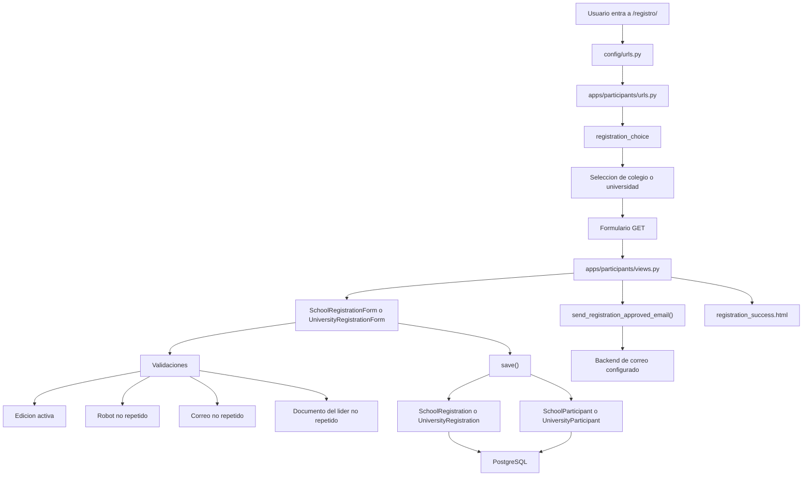
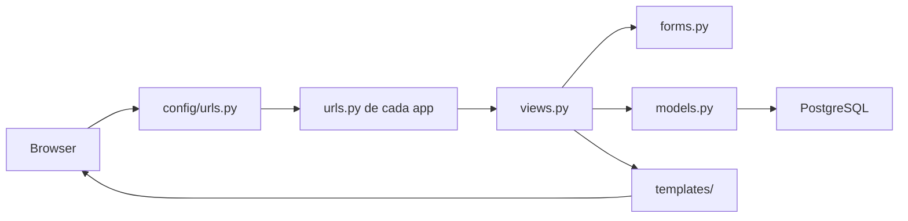

# Torneo Robot Explota Globos

Base inicial de un proyecto Django para administrar el torneo de robots explota globos de la Universidad Tecnologica de Pereira.

## Objetivo del proyecto

La plataforma esta pensada para cubrir tres frentes:

1. Publicar reglas y condiciones oficiales del evento.
2. Registrar robots provenientes de colegios y universidades.
3. Gestionar la logistica del torneo, incluyendo fases y enfrentamientos.

## Estructura del proyecto

- `config/`: configuracion central de Django.
- `apps/core/`: pagina principal y seccion publica de reglas.
- `apps/participants/`: inscripciones de colegios y universidades.
- `apps/tournament/`: ediciones, reglas publicadas, fases y enfrentamientos.
- `apps/common/`: componentes reutilizables como modelos abstractos.
- `static/`: estilos, PDF oficial y recursos publicos.
- `.venv/`: entorno virtual de Python.

## Modelo actual del dominio publico

- `SchoolRegistration`: inscripcion de un robot perteneciente a colegio.
- `UniversityRegistration`: inscripcion de un robot perteneciente a universidad.
- `SchoolParticipant`: integrantes del robot inscrito por colegio.
- `UniversityParticipant`: integrantes del robot inscrito por universidad.
- `TournamentEdition`: cada edicion del torneo.
- `RuleSection`: reglas publicables por secciones.
- `TournamentPhase`: fase configurable con `JSONField` para no fijar aun el formato.
- `Match`: enfrentamiento entre dos equipos con estado, puntaje y metadata flexible.

Importante: cada inscripcion publica representa un solo robot en competencia.

## Mapa rapido de carpetas

- `config/settings.py`: base de datos, seguridad, correo, apps instaladas y configuracion general.
- `config/urls.py`: enrutador principal del proyecto.
- `apps/core/views.py`: logica del inicio y pagina de reglas.
- `apps/participants/forms.py`: validaciones del formulario de inscripcion.
- `apps/participants/views.py`: flujo de registro y confirmacion.
- `apps/participants/services.py`: servicios auxiliares, por ejemplo envio de correo.
- `apps/participants/models.py`: tablas de inscripcion y participantes.
- `apps/tournament/views.py`: vista publica del torneo y panel interno.
- `apps/*/templates/`: HTML de cada modulo.
- `apps/*/migrations/`: historial de cambios de base de datos.
- `static/css/app.css`: estilo visual del sitio.
- `static/docs/ExplotaGlobos.pdf`: reglamento oficial embebido.

## Flujo de una inscripcion



## Flujo general de Django en este proyecto



## Seguridad y robustez

Esta base ya incluye medidas iniciales:

- `PROTECT` en relaciones criticas para evitar borrados accidentales.
- Configuracion de cookies seguras y cabeceras cuando `DEBUG=False`.
- Variables de entorno para secretos y parametros de base de datos.
- Indices basicos sobre campos de consulta frecuente.
- Bloqueo de duplicados por nombre de robot, correo y documento del lider en la edicion activa.
- Aprobacion automatica del registro al enviar el formulario.

## Como levantarlo en PyCharm

1. Crea un entorno virtual dentro del proyecto, por ejemplo `.venv`.
2. Instala dependencias con `pip install -r requirements.txt`.
3. Copia `.env.example` a `.env` y ajusta credenciales.
4. Crea la base de datos PostgreSQL desde pgAdmin4.
5. Ejecuta:

```bash
python manage.py makemigrations
python manage.py migrate
python manage.py createsuperuser
python manage.py runserver
```

## Conexion con PostgreSQL

Importante: `pgAdmin4` no conecta Django con la base de datos; es solo una herramienta visual de administracion.
Django se conecta directamente a PostgreSQL usando los datos de `.env`.

## Correo de confirmacion

El proyecto ya esta preparado para enviar confirmaciones automaticas al registrar.

- En desarrollo se puede usar `django.core.mail.backends.console.EmailBackend`.
- Para correo real, configura SMTP en `.env`.
- La logica del mensaje esta en `apps/participants/services.py`.

## Siguientes pasos recomendados

1. Diseñar la conversion de inscripciones aprobadas a equipos oficiales del torneo.
2. Definir el formato real de fases, clasificacion y playoffs.
3. Crear paneles operativos para aprobacion, check-in y resultados.
4. Incorporar pruebas automaticas y auditoria de cambios.
5. Preparar un entorno de pruebas en servidor institucional.
