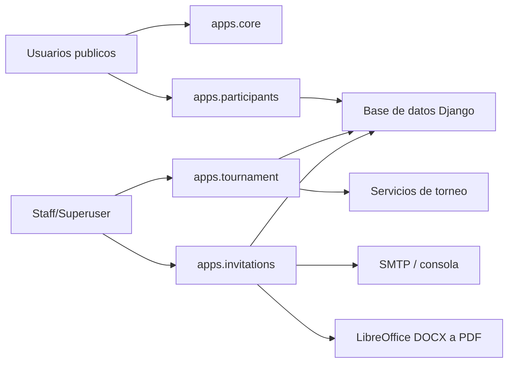

# 00. Resumen ejecutivo

## Alcance

Auditoria tecnica documental del proyecto Django ubicado en `C:\Projects\pre_explotaglobos`.
La revision se baso en codigo fuente, configuracion, estructura de carpetas, templates, assets, comandos de gestion y pruebas existentes.

No se modifico codigo funcional. La unica salida documental autorizada corresponde a `docs/auditoria_tecnica/`.

## Verificaciones iniciales

| Verificacion | Resultado |
| --- | --- |
| Directorio de trabajo | `C:\Projects\pre_explotaglobos` |
| Raiz Git | `C:/Projects/pre_explotaglobos` |
| Rama | `final-fases-repechaje-manual` |
| Estado inicial Git | Cambios tracked y untracked pendientes de consolidacion |
| CPython normal identificado | `%LOCALAPPDATA%\Programs\Python\Python312\python.exe` (3.12.10) |
| Python del proyecto | `C:\Projects\pre_explotaglobos\.venv\Scripts\python.exe` (base CPython 3.12.10) |
| `manage.py check` con `.venv` | Sin issues reportados |

## Estado confirmado del proyecto

| Area | Hallazgo confirmado |
| --- | --- |
| Framework | Django `>=5.2,<5.3` segun `requirements.txt` |
| Dominio | Plataforma web para registro, comunicaciones y control operativo del torneo Robot Explota Globos |
| Apps locales | `core`, `participants`, `tournament`, `invitations`, `common` |
| Persistencia | SQLite en desarrollo local con `DJANGO_DATABASE=sqlite`; PostgreSQL fuera de SQLite local |
| Frontend | Templates Django, CSS en `static/css/app.css`, JavaScript en `static/js/app.js` y `static/js/control.js` |
| Comunicaciones | Envio de correos, plantillas DOCX, conversion a PDF mediante LibreOffice y carga de destinatarios XLSX |
| Seguridad | `DEBUG=False` por defecto, `SECRET_KEY` requerida sin debug, cookies seguras y HSTS en produccion |
| Pruebas | Pruebas unitarias para distribuciones manuales y comunicaciones PDF/correo |

## Arquitectura general

## Hallazgos principales

1. El sistema esta modularizado por dominio y separa vistas publicas, registro de participantes, control de competencia y comunicaciones.
2. La logica critica del torneo esta centralizada principalmente en `apps/tournament/services.py`.
3. El flujo operativo soporta grupos, eliminatorias, repechajes, fases progresivas, fases manuales, multiples clasificados y podio final.
4. Las inscripciones publicas se transforman en equipos operativos al confirmar asistencia mediante token.
5. El modulo de comunicaciones implementa controles para simulacion segura, prueba controlada y envio oficial.
6. La configuracion impide SQLite sin `DEBUG=True` y exige variables sensibles en entornos no locales.

## Riesgos resumidos

| Riesgo | Evidencia | Impacto |
| --- | --- | --- |
| Concentracion de logica | `apps/tournament/services.py` tiene muchas responsabilidades y alto volumen de funciones | Mantenibilidad y regresiones |
| Comando demo destructivo | `reset_tournament_demo.py` elimina datos operativos antes de sembrar simulacion | Riesgo si se ejecuta en entorno real |
| Cobertura de pruebas limitada | Solo hay pruebas en `apps/tournament/tests.py` e `apps/invitations/tests.py` | Riesgo funcional en vistas, modelos y flujo completo |
| Dependencia externa LibreOffice | Conversion PDF depende de binario configurable o PATH | Riesgo operativo en despliegue |
| Uso de `.env` local | Existe `.env` ignorado por Git; auditoria no divulga valores | Requiere control de secretos fuera del repo |

## Calidad documental actual

El README contiene una descripcion funcional amplia y orientada a portafolio. La documentacion tecnica interna por modulo no existia antes de esta auditoria en `docs/auditoria_tecnica/`.

## Capitulos del futuro Manual Tecnico ya soportados

Pueden redactarse con esta base: arquitectura, instalacion y configuracion, modelo de datos, apps Django, URLs, vistas, formularios, servicios, flujo de competencia, templates, frontend, seguridad, base de datos, migraciones, pruebas, despliegue, mantenimiento, riesgos y glosario.
