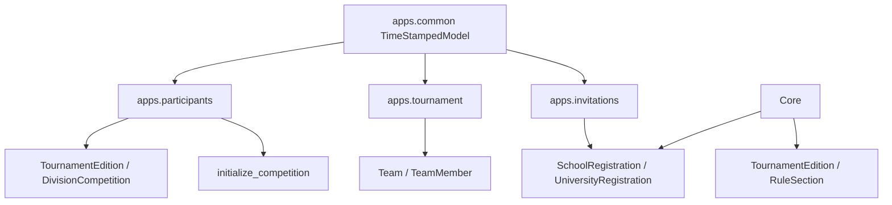

# 04. Apps Django

## Mapa de apps

| App | Config | Responsabilidad |
| --- | --- | --- |
| `apps.common` | `CommonConfig` | Base abstracta con timestamps |
| `apps.core` | `CoreConfig` | Sitio publico: home, reglas, patrocinadores |
| `apps.participants` | `ParticipantsConfig` | Inscripciones, participantes, asistencia y sincronizacion a equipos |
| `apps.tournament` | `TournamentConfig` | Ediciones, reglas, grupos, batallas, estados, recomendaciones y panel |
| `apps.invitations` | `InvitationsConfig` | Comunicaciones, plantillas, destinatarios, lotes y logs |

## Dependencias entre apps

## `apps.core`

| Funcion | Archivo | Descripcion |
| --- | --- | --- |
| `sponsor_catalog` | `apps/core/views.py` | Catalogo fijo de patrocinadores con nombre, URL, logo y color |
| `home` | `apps/core/views.py` | Consulta edicion activa, reglas publicadas, conteos de registros y sponsors |
| `rules_page` | `apps/core/views.py` | Lista reglas publicadas |
| `sponsors_page` | `apps/core/views.py` | Muestra catalogo de patrocinadores |

## `apps.participants`

1. Modela registros de colegio y universidad.
2. Modela participantes asociados a cada registro.
3. Modela instituciones, equipos y miembros operativos.
4. Valida duplicados de robot, correo y documentos.
5. Envia correo de registro recibido.
6. Confirma asistencia por token y sincroniza registro a `Team`.
7. Inicializa competencia por division cuando corresponde.

### Administracion Django

Fuente: `apps/participants/admin.py`

| Admin | Modelo | Elementos relevantes |
| --- | --- | --- |
| `InstitutionAdmin` | `Institution` | Lista nombre, tipo, ciudad, departamento; filtros por tipo |
| `SchoolRegistrationAdmin` | `SchoolRegistration` | Incluye `SchoolParticipantInline`; filtros por estado y edicion |
| `UniversityRegistrationAdmin` | `UniversityRegistration` | Incluye `UniversityParticipantInline`; muestra semestre |
| `TeamAdmin` | `Team` | Incluye `TeamMemberInline`; filtros por estado, edicion y tipo de institucion |

Acciones admin confirmadas mediante `RegistrationAdminMixin`:

| Accion | Efecto |
| --- | --- |
| `send_attendance_requests` | Construye URL de confirmacion y llama `send_attendance_confirmation_request_email` por registro no confirmado |
| `sync_confirmed_to_teams` | Sincroniza registros con asistencia confirmada hacia `Team` mediante `sync_registration_to_team` |

## `apps.tournament`

1. Modela ediciones, reglas, fases, competencias por division, grupos, batallas, estados e historial.
2. Calcula perfiles automaticos por cantidad de equipos.
3. Permite configuracion manual de grupos y fases.
4. Materializa fases progresivas, repechajes y podio final.
5. Expone panel interno para organizadores.

### Administracion Django

Fuente: `apps/tournament/admin.py`

| Admin | Modelo | Elementos relevantes |
| --- | --- | --- |
| `TournamentEditionAdmin` | `TournamentEdition` | Incluye `RuleSectionInline` |
| `TournamentPhaseAdmin` | `TournamentPhase` | Filtros por tipo y visibilidad |
| `RuleSectionAdmin` | `RuleSection` | Busqueda por titulo, resumen y edicion |
| `MatchAdmin` | `Match` | Filtros por estado y edicion de fase |
| `DivisionCompetitionAdmin` | `DivisionCompetition` | Filtros por division, estado y edicion |
| `DivisionGroupAdmin` | `DivisionGroup` | Lista competencia, label, orden y tamano esperado |
| `DivisionGroupEntryAdmin` | `DivisionGroupEntry` | Muestra ranking y clasificacion desde grupo |
| `CompetitionBattleAdmin` | `CompetitionBattle` | Filtros por edicion, division, stage y estado |
| `CompetitionBattleEntryAdmin` | `CompetitionBattleEntry` | Busqueda por equipo y origen |
| `TeamCompetitionStateAdmin` | `TeamCompetitionState` | Filtros por stage y estado actual |
| `CompetitionHistoryEntryAdmin` | `CompetitionHistoryEntry` | Filtros por action type, stage y status |

## `apps.invitations`

1. Gestiona plantillas DOCX por tipo de comunicacion.
2. Valida marcadores requeridos en DOCX.
3. Lee destinatarios desde XLSX.
4. Renderiza DOCX personalizado.
5. Convierte DOCX a PDF.
6. Envia correos o simula envios.
7. Registra lotes y logs.

### Administracion Django

Fuente: `apps/invitations/admin.py`

| Admin | Modelo | Elementos relevantes |
| --- | --- | --- |
| `CommunicationTemplateAdmin` | `CommunicationTemplate` | `validation_errors`, `created_at` y `updated_at` son solo lectura |
| `CommunicationRecipientAdmin` | `CommunicationRecipient` | Filtro por tipo y busqueda por nombre, correo e institucion |
| `CommunicationBatchAdmin` | `CommunicationBatch` | Incluye `CommunicationLogInline`; muestra modo, destinatario de prueba y creador |
| `CommunicationLogAdmin` | `CommunicationLog` | Muestra correo original, correo fisico, tipo, estado y fechas |

## `apps.common`

Contiene `TimeStampedModel`, modelo abstracto con `created_at` y `updated_at`.

## Mejora realizada en Fase 2

Se agrego la cobertura de `admin.py` para `participants`, `tournament` e `invitations`, incluyendo acciones administrativas que pueden enviar solicitudes de asistencia o sincronizar registros confirmados.
