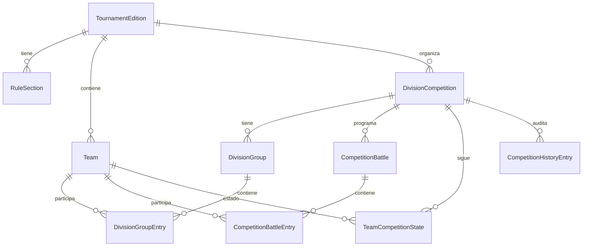

# 05. Modelos

## Modelo base

| Modelo | Archivo | Campos |
| --- | --- | --- |
| `TimeStampedModel` | `apps/common/models.py` | `created_at`, `updated_at` |

## Participantes e inscripciones

| Modelo | Archivo | Responsabilidad |
| --- | --- | --- |
| `SchoolRegistration` | `apps/participants/models.py` | Registro publico de colegio |
| `UniversityRegistration` | `apps/participants/models.py` | Registro publico universitario, incluye `semester` |
| `SchoolParticipant` | `apps/participants/models.py` | Integrante asociado a registro escolar |
| `UniversityParticipant` | `apps/participants/models.py` | Integrante asociado a registro universitario |
| `Institution` | `apps/participants/models.py` | Institucion operativa |
| `Team` | `apps/participants/models.py` | Equipo oficial para competencia |
| `TeamMember` | `apps/participants/models.py` | Integrante operativo de equipo |

### Campos comunes de registro

| Campo | Tipo/Regla |
| --- | --- |
| `edition` | FK a `tournament.TournamentEdition`, `PROTECT` |
| `institution_name` | Nombre de institucion |
| `responsible_name` | Responsable |
| `robot_name` | Nombre del robot |
| `contact_phone` | Regex telefono |
| `contact_email` | `EmailField` |
| `status` | `RegistrationStatus`, default `submitted` |
| `attendance_token` | UUID unico |
| `receipt_email_sent_at` | Fecha envio recibido |
| `attendance_request_sent_at` | Fecha solicitud asistencia |
| `attendance_confirmed_at` | Fecha confirmacion asistencia |
| `team_synced_at` | Fecha sincronizacion a equipo |

### Restricciones confirmadas

| Modelo | Restriccion |
| --- | --- |
| `SchoolRegistration` | Unico por `edition`, `institution_name`, `robot_name` |
| `UniversityRegistration` | Unico por `edition`, `institution_name`, `robot_name` |
| `Team` | Unico por `edition`, `institution`, `name` |
| `TeamMember` | `document_number` unico |

## Torneo

| Modelo | Responsabilidad |
| --- | --- |
| `TournamentEdition` | Edicion del torneo; solo una activa por restriccion condicional |
| `RuleSection` | Reglas publicables por edicion |
| `TournamentPhase` | Fases flexibles historicas/genericas |
| `Match` | Enfrentamientos genericos asociados a `TournamentPhase` |
| `DivisionCompetition` | Competencia operativa por division |
| `DivisionGroup` | Grupo dentro de una competencia |
| `DivisionGroupEntry` | Equipo asignado a un grupo |
| `CompetitionBattle` | Batalla por etapa operativa |
| `CompetitionBattleEntry` | Equipo dentro de batalla |
| `TeamCompetitionState` | Estado actual del equipo dentro de la competencia |
| `CompetitionHistoryEntry` | Historial de movimientos/resultados |

### Restricciones del torneo

| Modelo | Restriccion |
| --- | --- |
| `TournamentEdition` | `single_active_tournament_edition` |
| `DivisionCompetition` | `unique_competition_per_division` por edicion/division |
| `DivisionGroup` | `label` y `order` unicos por competencia |
| `DivisionGroupEntry` | Equipo, slot y ranking unicos por grupo |
| `CompetitionBattle` | Orden unico por competencia/stage |
| `CompetitionBattleEntry` | Equipo y slot unicos por batalla |
| `TeamCompetitionState` | Estado unico por competencia/equipo |
| `Match` | Check `prevent_self_match` |

## Comunicaciones

| Modelo | Responsabilidad |
| --- | --- |
| `CommunicationTemplate` | Plantilla DOCX, tipo, marcadores requeridos, estado activo |
| `CommunicationRecipient` | Destinatario reusable |
| `CommunicationBatch` | Lote de comunicacion |
| `CommunicationLog` | Resultado por destinatario |

## Enumeraciones relevantes

| Enum | Valores principales |
| --- | --- |
| `RegistrationStatus` | `draft`, `submitted`, `approved`, `rejected` |
| `DivisionType` | `school`, `university` |
| `CompetitionStage` | `groups`, `purgatory_1`, `round_of_32`, `round_of_16`, `purgatory_2`, `quarterfinal`, `semifinal`, `third_place`, `final` |
| `BattleFormat` | `group`, `battle_royale`, `duel`, `triangular` |
| `ParticipantStatus` | `active`, `eliminated`, `repechage`, `qualified`, `withdrawn` |
| `CommunicationSendMode` | `dry_run`, `test`, `official` |
