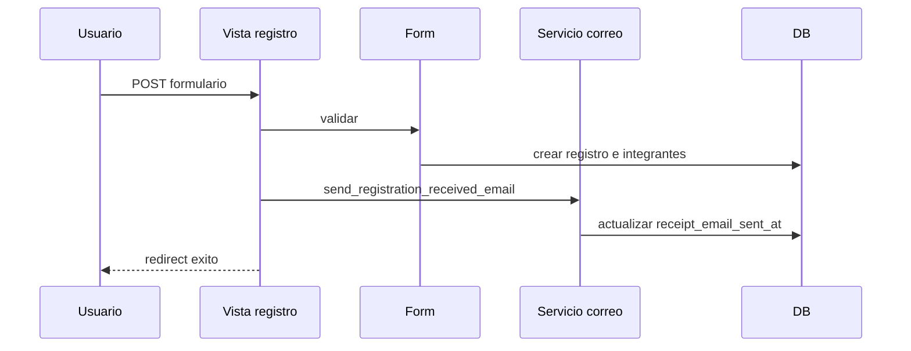

# 07. Views

## `apps.core.views`

| Vista | Template | Datos consultados |
| --- | --- | --- |
| `home` | `core/home.html` | Edicion activa, reglas publicadas, conteo colegios/universidades, sponsors, imagenes externas |
| `rules_page` | `core/rules.html` | Edicion activa, reglas publicadas |
| `sponsors_page` | `core/sponsors.html` | Edicion activa, catalogo de sponsors, conteo con link |

## `apps.participants.views`

| Vista | Metodo | Responsabilidad |
| --- | --- | --- |
| `registration_choice` | GET | Seleccion de categoria |
| `school_register` | GET/POST | Formulario escolar, guardado y correo recibido |
| `university_register` | GET/POST | Formulario universitario, guardado y correo recibido |
| `registration_success` | GET | Confirmacion visual |
| `resolve_registration_by_token` | Helper | Busca token en registros escolares y universitarios |
| `attendance_confirmation` | GET/POST | Confirma asistencia y sincroniza equipo |

## `apps.tournament.views`

| Vista/helper | Responsabilidad |
| --- | --- |
| `overview` | Vista publica de edicion y fases |
| `is_organizer` | Autoriza staff/superuser |
| `manual_overrides_from_post` | Lee configuracion manual de POST |
| `wants_json_response` | Detecta AJAX por `X-Requested-With` |
| `manual_override_requested` | Detecta confirmacion manual |
| `control_dashboard` | Dashboard interno, genera competencias por division |
| `control_division` | Operacion por division, configuracion, grupos y acciones generales |
| `control_division_stage` | Operacion por fase, resultados, repechajes, fase recomendada, fase manual y podio |
| `participant_modal_detail` | JSON de participante |
| `participant_modal_update` | Actualizacion AJAX de estado manual |
| `control_phase_detail` | Detalle de `TournamentPhase` generica |

Acciones POST confirmadas:

| Accion | Servicio |
| --- | --- |
| `generate_competition` | `initialize_competition` |
| `save_group_qualifiers` | `set_group_qualifiers` |
| `save_battle_winner` | `set_battle_winner` |
| `save_battle_qualifiers` | `set_battle_qualifiers` |
| `apply_auto_configuration` | `initialize_competition` |
| `apply_manual_configuration` | `initialize_competition` con overrides |
| `save_group_layout` | `update_group_layout` |
| `reset_competition` | `reset_competition_state` |
| `save_final_podium` | `save_final_podium` |
| `create_recommended_phase` | `materialize_recommended_duel_stage` |
| `create_repechage_phase` | `materialize_repechage_stage` |
| `generate_manual_phase_proposal` | `generate_manual_phase_proposal` |
| `confirm_manual_phase_proposal` | `confirm_manual_phase_proposal` |

## `apps.invitations.views`

| Vista | Responsabilidad |
| --- | --- |
| `dashboard` | Indicadores de correo, plantillas, logs y confirmaciones pendientes |
| `template_list` | Lista plantillas y agrupacion por tipo |
| `template_create` | Carga y valida plantilla DOCX |
| `template_preview` | Extrae marcadores DOCX |
| `invitations` | Agrega destinatarios y procesa lotes desde DB o XLSX |
| `confirmations` | Envia/simula solicitudes de asistencia |
| `history` | Lista lotes y logs recientes |

## Observaciones

1. El panel interno mezcla navegacion HTML con endpoints JSON para AJAX.
2. Las acciones destructivas del panel (`reset_competition`) requieren `confirm_reset=yes`.
3. Las correcciones manuales posteriores a fases iniciadas usan `ManualCorrectionRequired` y confirmacion AJAX o mensaje.
