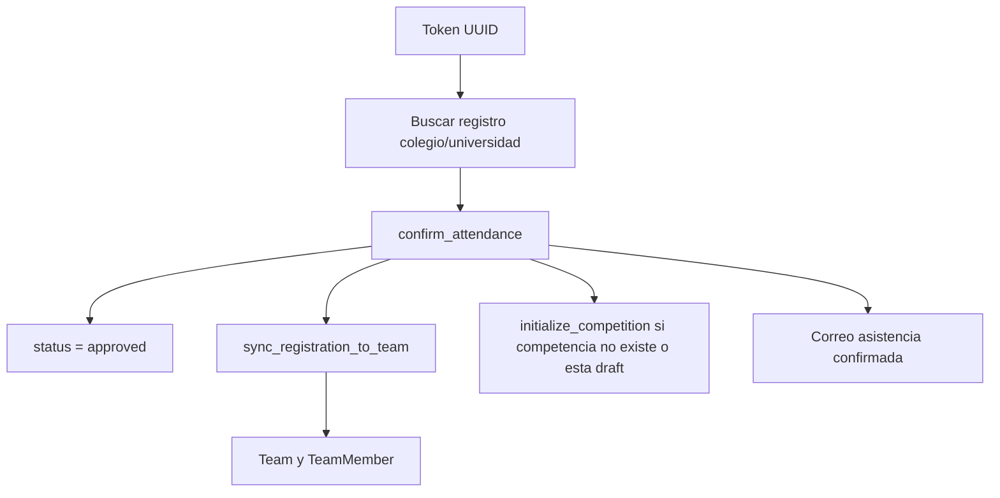

# 09. Servicios

## `apps.participants.services`

| Funcion | Responsabilidad |
| --- | --- |
| `registration_type_labels` | Traduce tipo de registro a etiquetas |
| `send_registration_received_email` | Envia correo de recibido y actualiza `receipt_email_sent_at` |
| `send_attendance_confirmation_request_email` | Envia enlace de confirmacion y actualiza `attendance_request_sent_at` |
| `send_attendance_confirmed_email` | Envia correo de asistencia confirmada |
| `sync_registration_to_team` | Crea/actualiza `Institution`, `Team` y `TeamMember` desde registro |
| `confirm_attendance` | Marca asistencia, aprueba registro, sincroniza equipo e inicializa competencia si aplica |

## `apps.tournament.formats`

| Funcion | Responsabilidad |
| --- | --- |
| `balanced_group_sizes` | Distribuye cupos balanceados |
| `pairing_labels` | Crea cruces tipo `1A` vs `2B` |
| `build_profile` | Valida y arma perfil de competencia |
| `profile_summary` | Resume perfil en texto |
| `auto_profile` | Selecciona modo automatico por cantidad de equipos |
| `competition_profile` | Usa automatico o override manual |

| Rango equipos | Modo |
| --- | --- |
| `<4` | `minimum_pending` |
| `4..15` | `sprint_final4` |
| `16..31` | `classic_final8` |
| `32..63` | `explosion_standard` |
| `>=64` | `explosion_extended` |

## `apps.tournament.services`

| Grupo | Funciones |
| --- | --- |
| Inicializacion | `initialize_competition`, `rebuild_competition_scaffold`, `ensure_stage_battles`, `ensure_team_states` |
| Grupos | `balanced_group_assignments`, `set_group_qualifiers`, `update_group_layout`, `groups_are_complete` |
| Batallas | `set_battle_winner`, `set_battle_qualifiers`, `set_battle_entries`, `clear_battles` |
| Repechaje | `materialize_repechage_stage`, `_safe_repechage_plan`, `_repechage_candidate_states` |
| Fases progresivas | `materialize_recommended_duel_stage`, `_materialize_balanced_group_round`, `_materialize_final_and_optional_third_place` |
| Fases manuales | `manual_phase_context`, `generate_manual_phase_proposal`, `confirm_manual_phase_proposal`, `cancel_manual_phase_proposal` |
| Estado | `sync_team_states`, `sync_competition`, `update_participant_state` |
| Presentacion | `stage_summary`, `competition_stage_navigation`, `build_stage_context`, `participant_modal_payload` |
| Podio | `save_final_podium`, `final_podium_payload` |

## `apps.tournament.recommendations`

Responsabilidades: snapshot de participantes, conteos por estado, recomendaciones de siguiente fase, repechaje opcional, ronda grupal balanceada y tercer lugar.

## `apps.invitations.services`

| Grupo | Funciones |
| --- | --- |
| Marcadores DOCX | `extract_docx_text_markers`, `parse_required_markers`, `validate_template_markers` |
| Render DOCX | `render_docx_template`, `_replace_in_paragraph` |
| PDF | `resolve_libreoffice_binary`, `convert_docx_to_pdf`, `build_pdf_attachment` |
| Excel | `load_recipients_from_xlsx` |
| Correo | `is_real_email_configured`, `send_communication_email`, `send_rendered_invitation` |
| Lotes/logs | `create_communication_batch`, `_create_or_update_log`, `mark_batch_finished` |
| Asistencia | `send_attendance_request_for_registration` |

## Observacion tecnica

`apps/tournament/services.py` concentra inicializacion, reglas de negocio, sincronizacion, generacion de contexto y operaciones manuales. Esto es funcionalmente coherente, pero aumenta el riesgo de regresion por cambios futuros.
