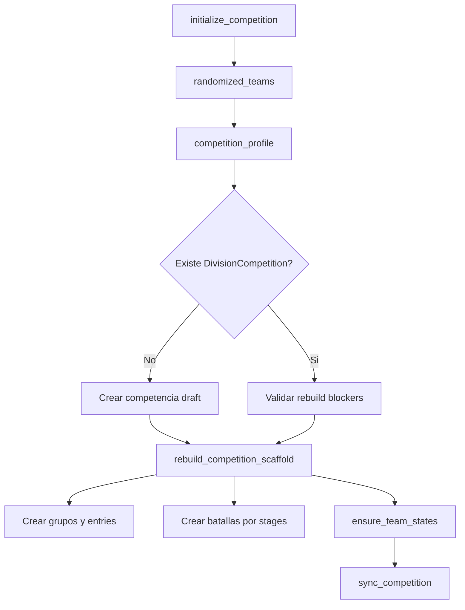
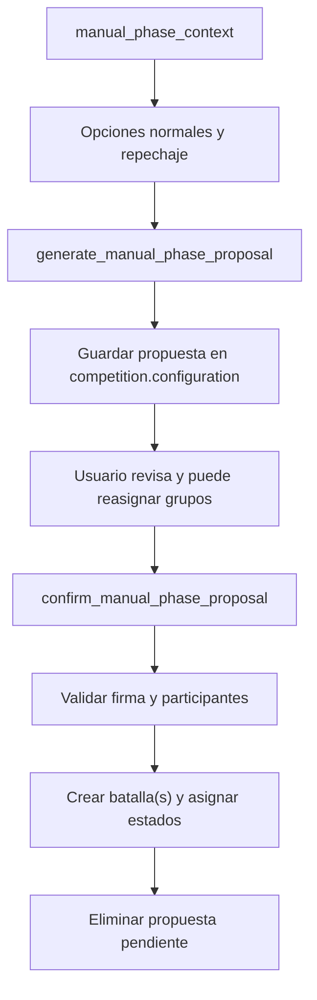

# 10. Flujo de competencia

## Entrada de participantes

1. Un registro publico se crea en `SchoolRegistration` o `UniversityRegistration`.
2. La asistencia se confirma mediante token UUID.
3. `confirm_attendance` aprueba el registro.
4. `sync_registration_to_team` crea/actualiza `Team` y `TeamMember`.
5. Si no existe competencia o esta en borrador, se llama `initialize_competition`.

## Inicializacion de competencia

## Perfiles automaticos

| Equipos | Configuracion |
| --- | --- |
| Menos de 4 | Modo pendiente, sin torneo automatico |
| 4 a 15 | 2 grupos, 2 clasificados por grupo, semifinal/final |
| 16 a 31 | 4 grupos, 2 clasificados, cuartos/semifinal/final |
| 32 a 63 | 8 grupos, 2 clasificados, repechaje 1 |
| 64 o mas | 16 grupos, ronda de 32, repechaje 1 |

## Fase de grupos

1. `balanced_group_assignments` distribuye equipos procurando separar instituciones.
2. `set_group_qualifiers` exige seleccionar exactamente `qualifiers_per_group`.
3. Cada cambio registra `CompetitionHistoryEntry`.
4. `sync_competition` actualiza estados y si todos los grupos estan completos prepara la siguiente estructura.

## Eliminatorias

| Funcion | Rol |
| --- | --- |
| `seed_duel_stage` | Carga cruces desde clasificados |
| `seed_next_duel_stage` | Carga ganadores de fase anterior |
| `wire_final_stages` | Conecta semifinal, tercer lugar y final |
| `set_battle_winner` | Guarda ganador unico |
| `set_battle_qualifiers` | Guarda multiples clasificados |

## Repechajes

`materialize_repechage_stage` sincroniza estados, calcula candidatos, define formato seguro, reusa etapa abierta si existe, crea batallas y marca estado `REPECHAGE`.

| Candidatos | Formato |
| --- | --- |
| 2 | 1 duelo |
| 3 | 1 triangular |
| 4 | 2 duelos |
| 6 | 2 triangulares |
| >=4 | Campales balanceadas, hasta 4 |

## Fases manuales

Controles: firmas SHA-256, bloqueo de duplicados/faltantes, no permite grupos vacios, no permite que clasifiquen todos los integrantes de un grupo y bloquea crear otra fase si hay una abierta.

## Cierre y podio

`save_final_podium` valida final existente, valida posiciones distintas dentro de la final, guarda `final_podium` en `competition.configuration` y marca la competencia `COMPLETED`.

## Estados de competencia

| Estado | Uso |
| --- | --- |
| `draft` | Falta completar grupos o no hay perfil activo |
| `ready` | Estructura lista sin batallas finalizadas |
| `in_progress` | Hay resultados o flujo progresivo abierto |
| `completed` | Final terminada o podio guardado |
