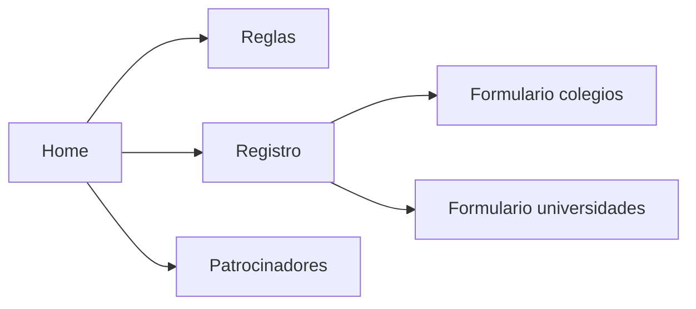
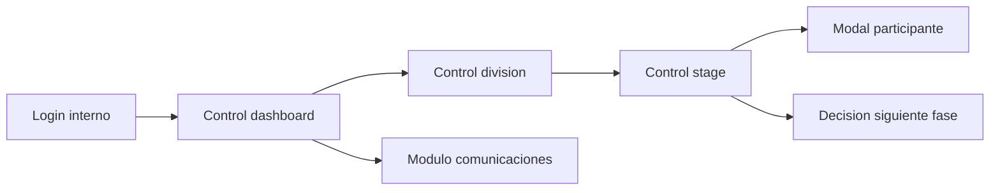

# 12. Frontend

## Arquitectura frontend

El frontend esta implementado con templates Django server-side, CSS centralizado en `static/css/app.css`, JavaScript publico en `static/js/app.js`, JavaScript interno en `static/js/control.js` y assets estaticos.

## Layouts

| Layout | Archivo | Uso |
| --- | --- | --- |
| Publico | `apps/core/templates/core/base.html` | Home, reglas, sponsors, registros |
| Interno | `apps/tournament/templates/tournament/control_base.html` | Torneo y comunicaciones |

## Componentes visuales confirmados

| Componente | Evidencia |
| --- | --- |
| Header sticky | `.site-header`, `.is-scrolled` en CSS/JS |
| Tema claro/oscuro | `data-theme-toggle`, `preExplotaGlobosTheme` |
| Cards | `.card`, `.rule-card`, `.sponsor-card`, `.phase-plan-card` |
| Formularios | `.form-grid`, `.field`, `.form-actions` |
| Tablas | `.table-shell` |
| Modales | `.participant-modal`, `.phase-decision-modal` |
| Navegacion por fases | `.phase-nav`, `.phase-nav-link` |
| Resultados | `.result-choice-card`, `.winner-choice-card`, badges |

## Flujo publico

## Flujo interno

## Responsividad

`static/css/app.css` incluye media queries para `max-width: 920px`, `hover: none`, `max-width: 800px` y `max-width: 460px`.

## Dependencias frontend externas

| Recurso | Estado |
| --- | --- |
| Google Fonts | Se usan preconnects en templates base |
| Imagenes externas UTP | `apps/core/views.py` define URLs externas en `showcase_images` |

## Observaciones

1. No se detecta framework SPA; es render server-side con mejoras JavaScript.
2. `control.js` refresca secciones del DOM mediante `fetch` de la URL actual.
3. Los formularios internos de resultados tienen validacion de cliente y validacion de servidor.
