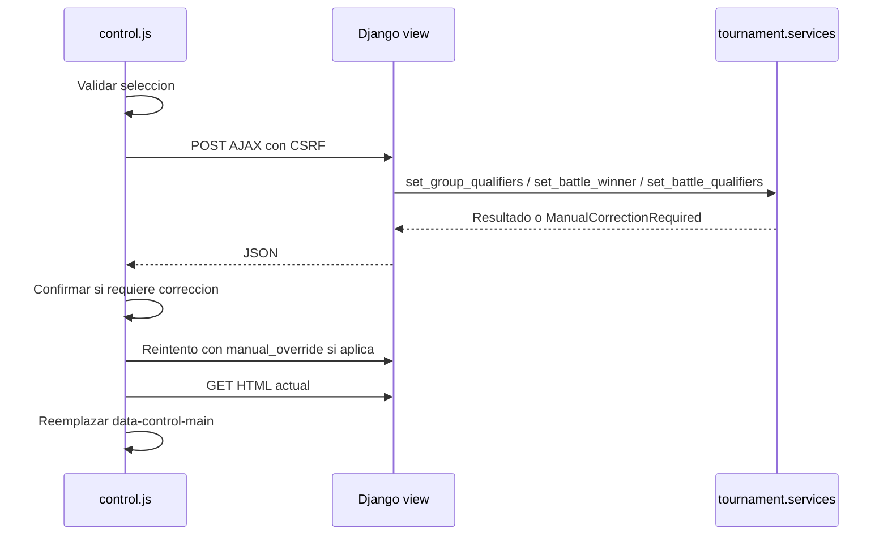

# 13. JavaScript

## Archivos

| Archivo | Ambito |
| --- | --- |
| `static/js/app.js` | Sitio publico |
| `static/js/control.js` | Panel interno y comunicaciones compartidas por layout interno |

## `static/js/app.js`

Responsabilidades confirmadas:

1. Inicializa tema claro/oscuro con `localStorage`.
2. Actualiza labels y atributos ARIA del boton de tema.
3. Cambia estado del header al hacer scroll.
4. Aplica animaciones de revelado con `IntersectionObserver`.
5. Agrega efecto de movimiento/tilt en hero para puntero fino.

| Elemento | Valor |
| --- | --- |
| Storage key | `preExplotaGlobosTheme` |
| Tema default | `dark` si no hay `light` |

## `static/js/control.js`

| Area | Funciones/Comportamiento |
| --- | --- |
| Tema | Misma llave `preExplotaGlobosTheme` |
| Modal participante | Carga JSON, renderiza formulario y historial |
| Actualizacion participante | POST AJAX a endpoint de actualizar participante |
| Resultados | Control de radio/checkbox para ganador o clasificados |
| Guardado AJAX | `saveResultForm` con `X-CSRFToken` y `X-Requested-With` |
| Correccion manual | Si servidor devuelve `requires_confirmation`, usa `window.confirm` y reintenta con `manual_override` |
| Guardado multiple | `data-save-all-results` guarda formularios modificados |
| Decision de fase | Modal para recomendacion, repechaje o manual |
| Asistente manual | Calcula tamanos de grupo, clasificados y resumen en cliente |
| Refresco | `refreshControlContent` reemplaza `[data-control-main]` con HTML nuevo |

## Flujo AJAX de resultado

## Riesgos JavaScript

| Riesgo | Evidencia |
| --- | --- |
| Alta dependencia de atributos `data-*` | `control.js` selecciona numerosos elementos por `data-*` |
| Refresco parcial por HTML | `refreshControlContent` parsea HTML de la pagina completa |
| Uso de `alert`/`confirm` | Confirmaciones y errores de cliente dependen de dialogs nativos |
| Logs de debug | `console.debug("[control.js] loaded ...")` y logs de decision de fase |

## No confirmado

| Punto | Estado |
| --- | --- |
| Pruebas automatizadas frontend | NO CONFIRMADO |
| Bundler o pipeline JS | NO FUE POSIBLE DETERMINARLO; no se observa package manager |
